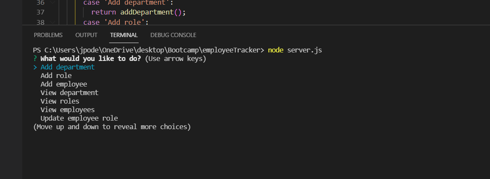
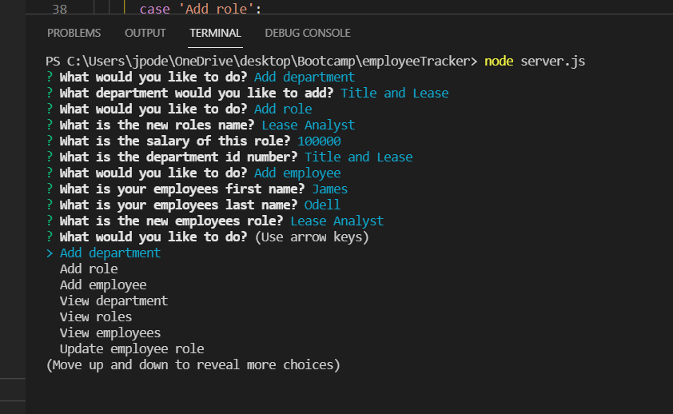
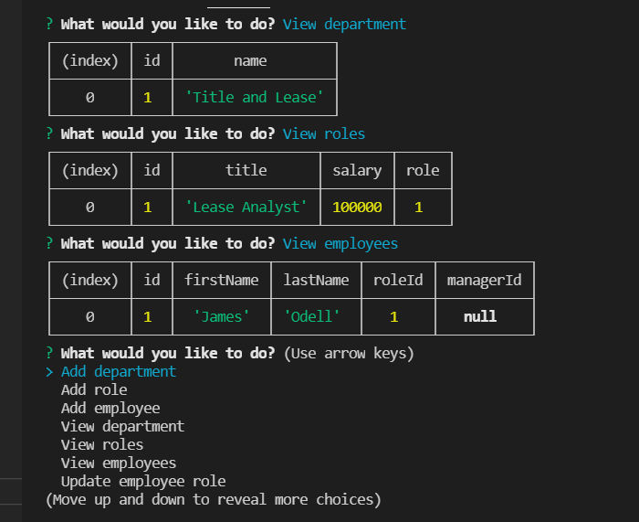
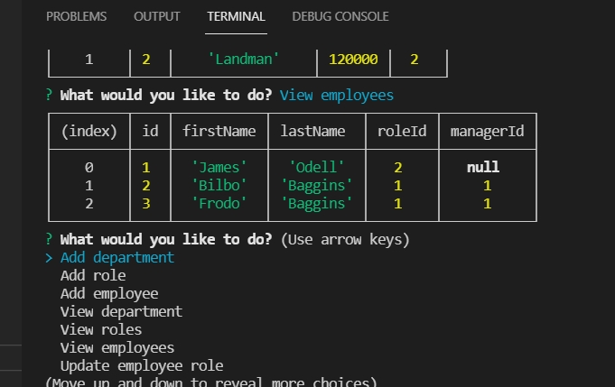

# Employee Tracker

## Project Description
* This is a Node.js command-line application for employee management. You are able to create new departments, roles and employees. As well you are able to update employee status/salary and employee roles. Also, you are able to delete departments, roles and employees. This is an employee tracking system for all basic HR needs.

## Installations
* Inquirer
* MySQL
* util

## Usage Information
* This application will allow you to view and manage the departments, roles, and employees in my company. That way you can organize and plan your business.

## Contributor Guidelines
* Contribution rules are under the Code of Conduct section

## Code of Conduct
* [Contributor Code of Conduct](https://www.contributor-covenant.org/version/2/0/code_of_conduct/code_of_conduct.md)

## Test Instructions
* There is no test required for this app.

## Questions
* For additional help or questions about collaboration, please reach out to jpodell21@gmail.com
* Follow me on Github at [JamesO1231](http://github.com/JamesO1231)

## Video Tutorial
* [Video Tutorial Link]()

## Deployment Image

